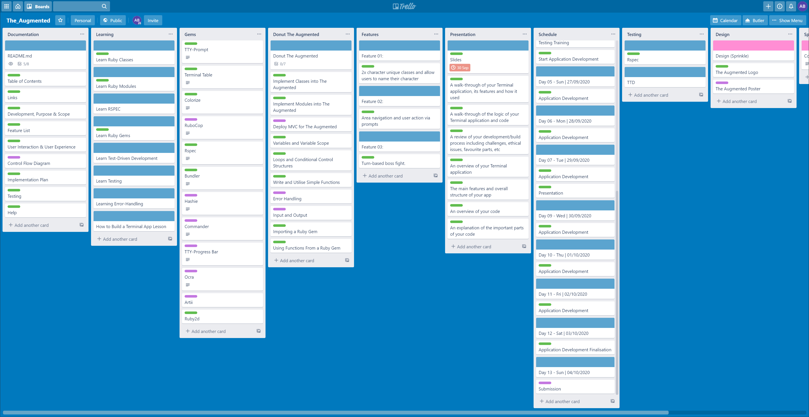

<br>

### Created by aBuiDev
# The Augmented 🦾

<br>


<br>

## Table of Contents
- [Links](###Links)
- [Development, Purpose & Scope](###Development,-Purpose-&-Scope)
- [Feature List](###Feature-List)
- [Gems](###Gems)
- [User Interaction & User Experience](###User-Interaction-&-User-Experience)
- [Control Flow Diagram](###Control-Flow-Development)
- [Implementation Plan](###Implementation-Plan)
- [Testing](###Testing)
- [Help](###Help)

<br>

#

### Links
* [GitHub Repository](https://github.com/aBuiDev/the_augmented.git)

<br>

#

<br>

### Development, Purpose & Scope
<br>

* **Description:** <br>
The Augmented is a text-based game that will prompt users to make emotionally driven decisions that will affect the story's outcome. The Augmented is an action RPG set in the year 2088 where humanity has begun to advance the technologies of being able to transpose machine with man via body augmentations. The Augmented universe is based loosely on Eidos' original Deus Ex PC game. The Augmented will take place in New York, on Staten Island - after highly trained and highly advanced unknown terrorists destroy the statue of liberty. The player will take on the role of Agent Caddel, a highly trained and heavily augmented CIA agent - because his body is now over 75% machine, he also fights an internal battle of self-discovery and self-identity.
<br>

* **Problem:** <br>
Many games created today have a main focus on graphics and gameplay only. This isn't necessarily a bad thing, however, it can sometimes overshadow the story-telling aspect of games. A game rich in an engaging story, much like a movie affords users/viewers to forget about the visuals and focus entirely on the characters and plot. The Augmented is a terminal only application that is limited to text and ASCII; the focus is entirely on the user's connection with the story and the characters.
<br>

* **Target Audience:** <br>
As this is a terminal application, the target audience is for people who have a solid grasp of computer fundamentals, including software engineering students and teachers. Set user interaction and/or player controls will be intuitive via the usage of prompts and simple text, which means most people will be able to play the game. Accessing and running the application will limit users to people with intermediate computer knowledge.
<br>

* **Target Audience Usage:** <br>
Users are to access the terminal application via a terminal client, i.e. Terminal on macOS, Command Prompt/Powershell on Windows, or GitBash. Users will need to have Ruby installed on their computers as well as enough knowledge to run the terminal application using: ```$ ruby the_augmented.rb```. Once the application is running, affordances will be set by the developer to allow users to already understand how to interact with the application when prompted.
<br>

<br>

#

<br>

### Feature List
<br>

* **Feature I:** <br>
Users can select from two different character classes. Each with different abilities and attributes, and each will impact The Augmented's story. This also includes letting the user set the main character's first name.
<br>

* **Feature II:** <br>
Users can navigate through the story and different locations via prompts. This will give users options of what they can do in the area or what to do next.
<br>

* **Feature II:** <br>
A final turn-based boss fight that will use Ruby's .rand() method to select what attack the final boss will use randomly, the user won't know what the attack will be and will have the option to choose from three different attacks or defences. If the boss counters the attack/defence, then the user will sustain damage and lose hitpoints. If the user's option counters the bosses attack, the user is given a chance to counter-attack and therefore able to do damage to the boss.
<br>

<br>

#

### Gems
<br>

* TTY-Prompt
* Colorize
* Bundler
* Rspec
* Ruby2d
* Terminal Table

<br>

#

<br>

### User Interaction & User Experience
<br>

The Augmented game layout is designed to be visually the same throughout, including colours as well as stylistic elements like the dotted bars to separate the different elements on each individual "screen" the player interacts with. Key repeating elements are used to help the user understand the layout and interactive possibilites of the application.


<br>

* **1. Location Titles & Headers** <br>
At the top of each section is a title that outlines where the user is at any given time. The Augmented story is split into four different locations: The Sewers, The Rendezvous, The Liberty Statue Head and the Liberty Statue Entrance. As the user navigates through the game, the title changes to help them navigate. This is an important element as one of the features of The Augmented is the ability to allow players to navigate back and forth to different areas.

<br>

* **2. Layout Elements** <br>
Layout elements are purposely implemented as a visual aid to help users distinguish between the different sections of the screen. In the screenshot above, a dotted line separator is used to separate the area title from the body text. Another dotted line is implemented at the bottom to separate the game text with the game controls.

<br>

* **3. Game Text** <br>
Text throughout the game are deployed between one second ```sleep``` methods. This user-focused feature is implemented so that the user has more engagement with the game story. This creates a better reading flow for the user instead of them being given a huge chunk of text to read though. This feature also allows for more interactive and immersive scripted sections where the user views custom ascii animations to aid with the story-telling. Game text are also split using empty lints to create a better reading experience for the user. 

<br>

* **4. Game Controls** <br>
Game controls are dynamic and are created using TTY-Prompt. They are positioned at the bottom of the page under the game text and separated by a dotted line separator. Game controls don't appear until all game text at the section has been deployed. Game Controls are also dynamic, each one having special options depending on where the user is located i.e. the image above shows the user can loot a certain creature, this looting specific looting option is only available inside the sewer. Instructions on how to use the controls are apparent in grey next to the game control's title.

<br>

#

<br>

### Control Flow Development
<br>

* **Control Flow Diagram:**

<br>

#

<br>

### Implementation Plan
<br>

* [Link to Trello Plan](https://trello.com/b/TNtHkGjY/theaugmented)

<br>

Screenshot of Trello Board on day of initialisation:


<br>

Screenshot of Trello Board on day before submission:



<br>

#

<br>

### Testing
<br>

* Two successful tests outputting using Rspec. Tested ability for the app to create a new class from a new_player instance.

<br>


<br>

#

<br>

### Help
<br>

1. Open a terminal / CLI.
2. Navigate to or create a directory you want "The Augmented" to be installed.
3. Once in that directory, run ```git clone git@github.com:aBuiDev/the_augmented.git``` to clone a copy of "The Augmented" onto your computer.
4. Before application can run, user must run 'bundle install' to require application dependencies.